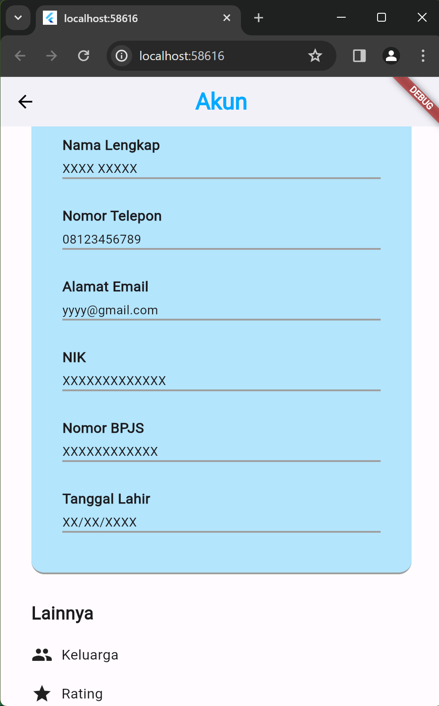
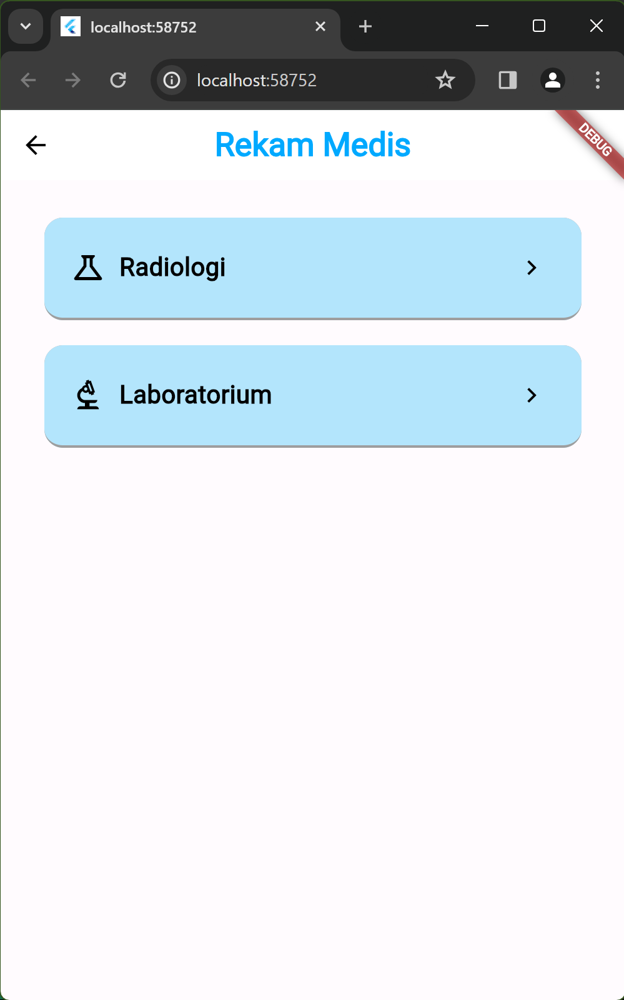
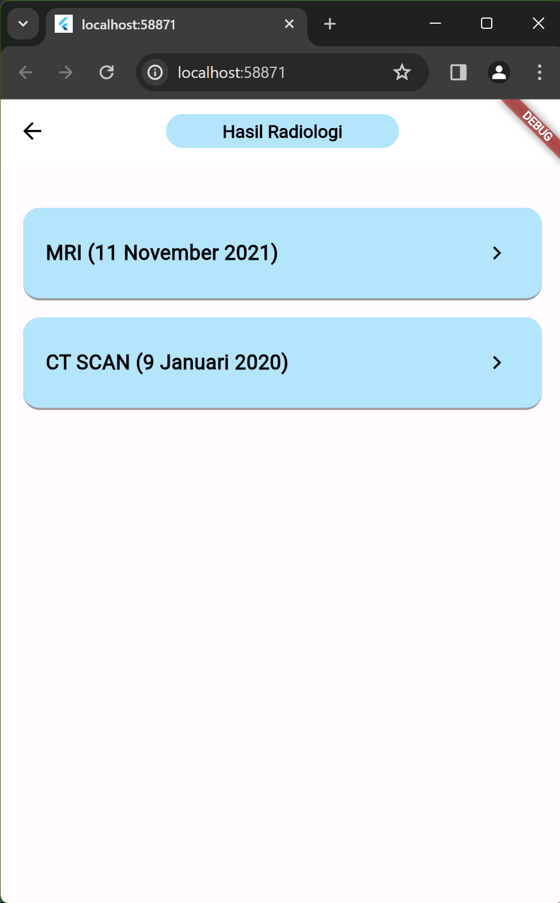

# TP2 PROVIS KELOMPOK 5 C1 2022

## Ketua dan Anggota Kelompok
1. Raya Cahya Nurani 2205714 (Ketua Kelompok)
2. Meiva Labibah Putri 2204343
3. Septiani Eka Putri 2206000
4. Shinta Adhisti 2202479
5. Syaila Fathia Azzahra 2206272

## Deskripsi
Proyek ini adalah aplikasi Flutter yang dibuat untuk platform layanan rawat jalan sebuah rumah sakit. Aplikasi ini memanfaatkan framework Flutter untuk membangun antarmuka pengguna yang responsif dan menarik.

## Page yang di kerjakan
1. Profile Page : Halaman akun pengguna yang sudah masuk kedalam aplikasi
2. Rekam medis page : Halaman tempat untuk melihat rekam medis pengguna
3. Radiologi : Halaman terusan dari rekam medis yang menampilkan hasil dari radiologi
4. Laboratorium : Halaman terusan dari rekam medis yang menampilkan hasil dari laboratorium

## Dokumentasi Program

Page Akun

Page Rekam Medis

Page Hasil Radiologi

Page Hasil Laboratorium
